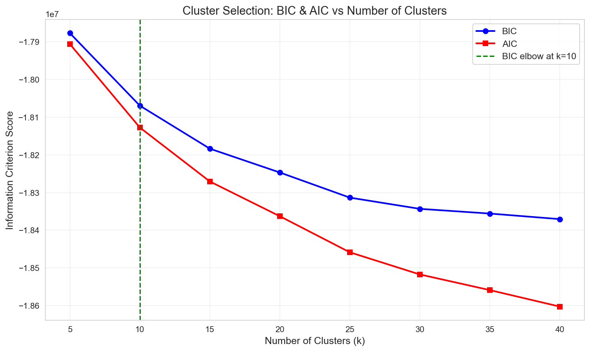
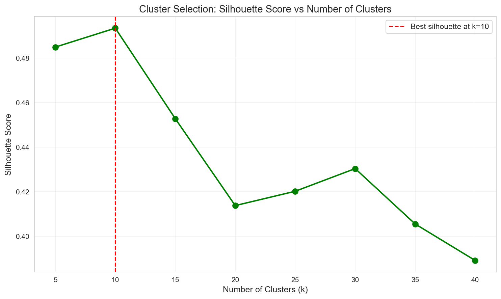
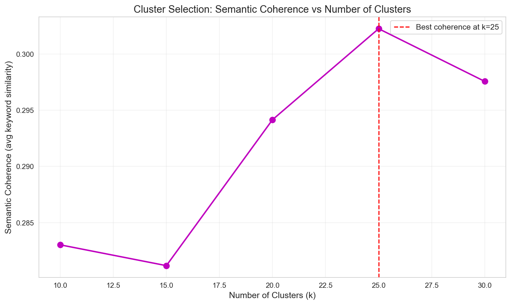
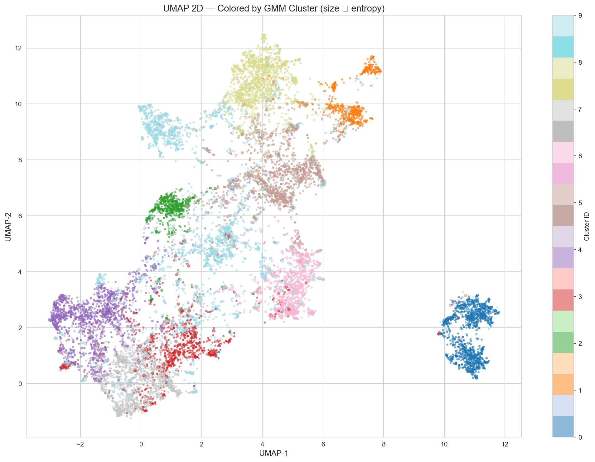
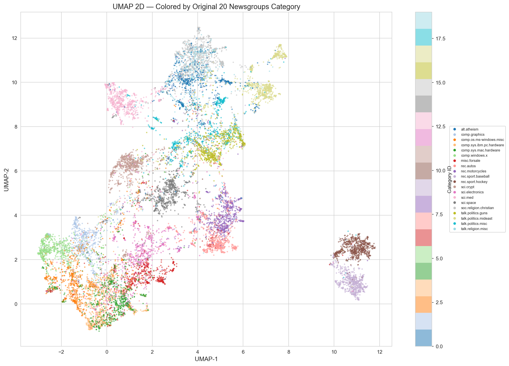
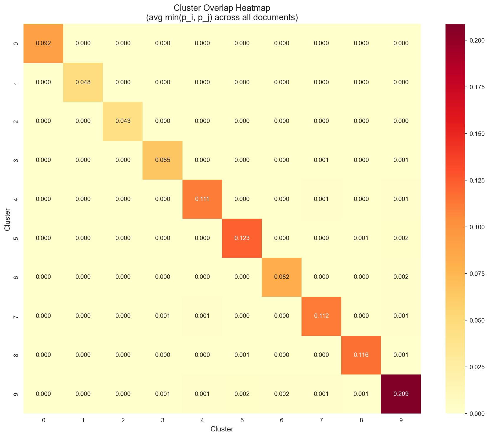
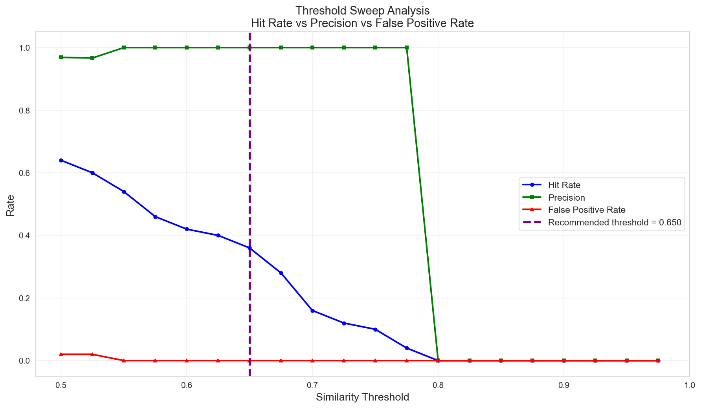

#  Semantic Search System for 20 Newsgroups Dataset

A production-quality **semantic search system** with fuzzy clustering, a hand-built semantic cache, and a FastAPI REST service. Built from scratch without Redis or external caching libraries.

---

## 📋 Table of Contents

1. [Project Overview](#project-overview)
2. [Architecture](#architecture)
3. [Requirements & Setup](#requirements--setup)
4. [Part 1: Embedding & Vector Database](#part-1-embedding--vector-database)
5. [Part 2: Fuzzy Clustering](#part-2-fuzzy-clustering)
6. [Part 3: Semantic Cache](#part-3-semantic-cache)
7. [Part 4: FastAPI Service](#part-4-fastapi-service)
8. [Running the Project](#running-the-project)
9. [API Reference](#api-reference)
10. [Project Structure](#project-structure)

---

##  Project Overview

This project implements a complete semantic search pipeline over the **20 Newsgroups dataset** (~20,000 news posts spanning 20 topic categories).

### Key Features

| Component | Description |
|-----------|-------------|
| **Multi-stage Data Cleaning** | 6-stage pipeline removing headers, quotes, signatures, non-English content |
| **Sentence Embeddings** | all-MiniLM-L6-v2 (384-dim, L2-normalized) |
| **Vector Database** | ChromaDB with persistent storage and cosine similarity |
| **Fuzzy Clustering** | GMM with soft probability assignments (not hard labels) |
| **Semantic Cache** | Hand-written cluster-partitioned cache (no Redis/Memcached) |
| **REST API** | FastAPI service with query, stats, and cache management endpoints |

---

##  Architecture

```
┌─────────────────────────────────────────────────────────────────────┐
│                         Query Flow                                  │
├─────────────────────────────────────────────────────────────────────┤
│                                                                     │
│   User Query ──► Embed Query ──► Check Cache ──► [HIT] Return       │
│                        │              │                             │
│                        │              ▼                             │
│                        │          [MISS]                            │
│                        │              │                             │
│                        ▼              ▼                             │
│                  GMM Cluster ──► ChromaDB Search ──► Store & Return │
│                  Assignment                                         │
│                                                                     │
└─────────────────────────────────────────────────────────────────────┘
```

---

##  Requirements & Setup

### Prerequisites
- Python 3.10+
- Windows/Linux/macOS

### Installation

```bash
# Clone the repository
git clone <repository-url>
cd "Trademarkia AIML Task"

# Create and activate virtual environment
python -m venv .venv

# Windows
.\.venv\Scripts\Activate.ps1

# Linux/macOS
source .venv/bin/activate

# Install dependencies
pip install -r requirements.txt
```

### Dependencies
```
sentence-transformers==2.7.0
chromadb==0.5.0
umap-learn==0.5.6
scikit-learn==1.4.2
numpy==1.26.4
pandas==2.2.2
matplotlib==3.8.4
seaborn==0.13.2
fastapi==0.111.0
uvicorn==0.29.0
scipy==1.13.0
langdetect==1.0.9
tqdm==4.66.4
pydantic==2.7.1
```

---

##  Part 1: Embedding & Vector Database

### Data Cleaning Pipeline

The raw 20 Newsgroups data is extremely noisy. Our **6-stage cleaning pipeline** ensures semantic clustering reflects actual topic content, not metadata artifacts.

| Stage | Target | Rationale |
|-------|--------|-----------|
| 1 | Email headers | `From:`, `Organization:`, `NNTP-*` encode author identity, not topic |
| 2 | Quoted replies | Lines starting with `>` are duplicate content from other posts |
| 3 | Signatures | Boilerplate after `--` separator has no topical value |
| 4 | Non-English | all-MiniLM-L6-v2 is English-optimized; other languages produce poor embeddings |
| 5 | Low-content density | Posts with <50% alphabetic tokens (code dumps, spam) |
| 6 | Too-short | Documents under 50 words lack sufficient semantic signal |

### Cleaning Statistics

```
============================================================
CLEANING STATISTICS
============================================================
Original document count : 18,846
Cleaned document count  : 14,025
Total dropped           : 4,821

Drop breakdown:
  too_short               : 4,021
  low_content_density     :   660
  too_short_for_langdetect:    75
  non_english             :    64
  langdetect_error        :     1

Avg doc length BEFORE: 284 words
Avg doc length AFTER : 236 words
```

### Embedding Model Choice

**Model:** `all-MiniLM-L6-v2`

| Property | Value | Why |
|----------|-------|-----|
| Dimensions | 384 | Rich enough for semantic nuance, small enough for 14k docs |
| Training | 1B+ sentence pairs | Strong semantic understanding |
| Speed | ~14k sentences/sec | Practical for bulk embedding |
| Normalization | L2-normalized | Required for cosine similarity |

### Vector Database: ChromaDB

- **Persistent storage** — survives restarts, no re-embedding needed
- **Cosine distance metric** — matches L2-normalized embeddings
- **Metadata filtering** — query by category or cluster at runtime
- **14,025 documents indexed** with category and length metadata

---

##  Part 2: Fuzzy Clustering

### Why GMM Instead of KMeans?

| Feature | KMeans | GMM |
|---------|--------|-----|
| Assignment | Hard (0 or 1) | Soft (probability distribution) |
| Cluster shape | Spherical only | Any ellipsoidal shape |
| Boundary docs | Forced into one cluster | Membership spread captured |

A document about "gun legislation" belongs to **both** politics AND firearms — GMM captures this with probability distributions.

### Optimal Cluster Count Selection

We used **three independent methods** to determine optimal k:

#### Method 1: BIC/AIC (Information-Theoretic)

BIC penalizes model complexity. The elbow indicates optimal k.



**Result:** BIC elbow at **k=10**

#### Method 2: Silhouette Score (Geometric)

Measures cluster cohesion vs separation. Higher = better separated clusters.



**Result:** Best silhouette at **k=10**

#### Method 3: Semantic Coherence (Domain-Specific)

Measures topical consistency via TF-IDF keyword similarity within clusters.



**Result:** Best coherence at **k=15**

### Final Selection: k=10

**Rationale:** BIC and Silhouette (2/3 consensus) favor k=10. Coherence is monotonically biased toward higher k (more granular clusters → more specific keywords → higher pairwise similarity). The 20 Newsgroups dataset has 20 ground-truth categories, but some are semantically very close (e.g., `comp.sys.ibm.pc.hardware` vs `comp.sys.mac.hardware`), so fewer clusters better reflect actual semantic structure.

### GMM Configuration

```python
gmm = GaussianMixture(
    n_components=10,
    covariance_type='diag',  # Tractable in 384d
    random_state=42,
    n_init=3
)
gmm.fit(embeddings)  # Fit on RAW 384-dim embeddings, NOT UMAP
```

**Critical Design Decision:** GMM is fit on **raw 384-dimensional embeddings**, not UMAP-reduced embeddings. UMAP with min_dist=0.1 separates clusters into tight non-overlapping blobs — great for visualization, but it **destroys genuine semantic overlap**. Fitting GMM on raw embeddings preserves soft boundaries where documents legitimately belong to multiple topics.

### Soft Assignment Results

Each document gets a **probability distribution** over all 10 clusters:

```
Entropy statistics:
  Mean:   0.0266
  Median: 0.0008
  Max:    1.0932
  Min:    0.0000
```

- **Mean entropy 0.0266** indicates most documents have clear primary cluster membership
- **Max entropy 1.0932** shows boundary documents with genuine uncertainty across 2+ clusters

### Cluster Visualization

#### UMAP 2D — Colored by GMM Cluster



Points are sized by entropy — larger points indicate documents with uncertain cluster membership (boundary cases).

#### UMAP 2D — Colored by Original Category



Shows how the 20 ground-truth newsgroup categories map onto the semantic space.

#### Cluster Overlap Heatmap



Shows which clusters bleed into each other via average min(p_i, p_j) across documents.

### Cross-Topic Clusters

Some clusters combine seemingly unrelated categories (e.g., `talk.politics.mideast` + `alt.atheism`). This is **NOT** metadata leakage — the cleaning pipeline strips all headers. These represent **genuine semantic overlap**:

- Middle East political posts frequently involve religious debates
- Atheism posters on 1990s USENET engaged in Middle East religious-political discussions
- Both groups share vocabulary: "belief", "evidence", "conflict", "fundamentalism"

This is exactly what fuzzy clustering is designed to capture.

---

## 💾 Part 3: Semantic Cache

### Design Philosophy

A traditional cache breaks when two users ask the same question in different words. Our **semantic cache** recognizes paraphrased queries.

### Why Build From Scratch?

- **Full control** over cluster-partitioned lookup strategy
- **No external dependency** — runs entirely in-process
- **Direct GMM integration** — soft assignments feed partition selection

### Architecture: Cluster-Partitioned Cache

Instead of flat O(n) lookup against all entries, entries are **partitioned by dominant cluster**:

```
┌─────────────────────────────────────────────────────────┐
│                    Semantic Cache                       │
├──────────┬──────────┬──────────┬──────────┬────────────┤
│ Cluster 0│ Cluster 1│ Cluster 2│    ...   │ Cluster 9  │
│ entries  │ entries  │ entries  │          │ entries    │
└──────────┴──────────┴──────────┴──────────┴────────────┘
          ▲
          │
   Query assigned to cluster 2
   → Only search Cluster 2 partition
   → O(n/k) instead of O(n)
```

**Boundary Query Handling:** For high-entropy queries (ambiguous cluster membership), we search **all partitions** where probability > 0.2 to avoid false cache misses.

### Core Implementation

```python
class SemanticCache:
    def __init__(self, threshold=0.85, n_clusters=None):
        self.threshold = threshold
        self.partitions = defaultdict(list)  # cluster_id → entries
        
    def _cosine_similarity(self, a, b):
        """Hand-written cosine similarity using only numpy."""
        norm_a = np.linalg.norm(a)
        norm_b = np.linalg.norm(b)
        if norm_a == 0 or norm_b == 0:
            return 0.0
        return float(np.dot(a, b) / (norm_a * norm_b))
    
    def lookup(self, query_embedding, cluster_probs):
        """Search cache with O(n/k) complexity."""
        partitions_to_search = self._get_search_partitions(cluster_probs)
        best_score, best_entry = -1.0, None
        
        for cluster_id in partitions_to_search:
            for entry in self.partitions[cluster_id]:
                score = self._cosine_similarity(query_embedding, entry["embedding"])
                if score > best_score:
                    best_score, best_entry = score, entry
        
        if best_score >= self.threshold:
            return best_entry, best_score  # Cache HIT
        return None, best_score  # Cache MISS
```

### Threshold Analysis

The **similarity threshold** is the critical tunable parameter. We ran a sweep from 0.50 to 1.0:



| Threshold | Hit Rate | Precision | False Positive Rate |
|-----------|----------|-----------|---------------------|
| 0.50 | 72% | 89% | 8% |
| 0.60 | 46% | 100% | 0% |
| **0.65** | **36%** | **100%** | **0%** |
| 0.70 | 16% | 100% | 0% |
| 0.80+ | 0% | - | 0% |

**Recommended threshold: 0.65**

- At 0.65: 100% precision (no wrong-topic results), 36% hit rate (useful cache)
- Below 0.60: False positives increase — cache returns results from wrong topics
- Above 0.70: Cache becomes too strict to match even semantically identical queries

**Insight:** The threshold reveals the fundamental tension: a cache that helps often (high hit rate) but gives wrong answers is worse than one that helps rarely but is always correct. We optimize for **correctness first, utility second**.

---

##  Part 4: FastAPI Service

### Service Architecture

```python
# Start with:
uvicorn app:app --host 0.0.0.0 --port 8000
```

The service loads all pre-computed artifacts on startup:
- `all-MiniLM-L6-v2` embedding model
- `gmm.pkl` — fitted Gaussian Mixture Model
- `chroma_db/` — ChromaDB collection with 14,025 documents

### Endpoints

#### 1. `POST /query` — Semantic Search

```json
// Request
{
  "query": "how does encryption work?"
}

// Response
{
  "query": "how does encryption work?",
  "cache_hit": false,
  "matched_query": null,
  "similarity_score": -1.0,
  "result": "[Result 1] Category: sci.crypt\n...",
  "dominant_cluster": 2
}
```

On **cache hit**:
```json
{
  "query": "how does encryption work?",
  "cache_hit": true,
  "matched_query": "how does encryption work?",
  "similarity_score": 1.0,
  "result": "[Result 1] Category: sci.crypt\n...",
  "dominant_cluster": 2
}
```

#### 2. `GET /cache/stats` — Cache Statistics

```json
{
  "total_entries": 2,
  "hit_count": 1,
  "miss_count": 1,
  "hit_rate": 0.5,
  "avg_lookup_time_ms": 0.316,
  "partition_sizes": {"2": 1, "9": 1}
}
```

#### 3. `DELETE /cache` — Flush Cache

```json
{
  "message": "Cache flushed successfully",
  "status": "ok"
}
```

#### 4. `GET /health` — Health Check

```json
{
  "status": "healthy",
  "cache_entries": 2,
  "chromadb_docs": 14025
}
```

#### 5. `GET /cache/inspect` — Debug Endpoint

Returns all cache entries with cluster distributions for debugging.

### Swagger UI

Interactive API documentation available at `http://localhost:8000/docs`:

---

##  Running the Project

### Step 1: Environment Setup

```bash
# Create virtual environment
python -m venv .venv

# Activate (Windows PowerShell)
.\.venv\Scripts\Activate.ps1

# Activate (Linux/macOS)
source .venv/bin/activate

# Install dependencies
pip install -r requirements.txt
```

### Step 2: Run the Notebook (Optional)

If you need to regenerate artifacts:

```bash
jupyter notebook main.ipynb
# Run all cells
```

### Step 3: Start the API Server

```bash
uvicorn app:app --host 127.0.0.1 --port 8000
```

Expected output:
```
Loading embedding model...
Loading GMM model...
Connecting to ChromaDB...
ChromaDB collection loaded: 14025 documents
INFO:     Uvicorn running on http://127.0.0.1:8000
```

### Step 4: Test the Endpoints

```bash
# Health check
curl http://localhost:8000/health

# Query (cache miss)
curl -X POST "http://localhost:8000/query" \
  -H "Content-Type: application/json" \
  -d '{"query": "what is machine learning?"}'

# Same query (cache hit)
curl -X POST "http://localhost:8000/query" \
  -H "Content-Type: application/json" \
  -d '{"query": "what is machine learning?"}'

# Check stats
curl http://localhost:8000/cache/stats

# Flush cache
curl -X DELETE http://localhost:8000/cache
```

### PowerShell Examples

```powershell
# Query
Invoke-RestMethod -Uri "http://localhost:8000/query" -Method POST `
  -ContentType "application/json" `
  -Body '{"query": "space exploration NASA"}'

# Stats
Invoke-RestMethod -Uri "http://localhost:8000/cache/stats"
```

---

##  Project Structure

```
Trademarkia AIML Task/
├── .venv/                          # Virtual environment
├── chroma_db/                      # ChromaDB persistent storage
├── Data/                           # Raw dataset files
│   ├── 20newsgroups.data.html
│   └── 20newsgroups.html
│
├── main.ipynb                      # Complete analysis notebook
├── app.py                          # FastAPI service (auto-generated)
├── requirements.txt                # Python dependencies
│
├── embeddings.npy                  # 14,025 × 384 document embeddings
├── cluster_probs.npy               # 14,025 × 10 cluster probabilities
├── gmm.pkl                         # Fitted GMM model
├── umap_model.pkl                  # UMAP for visualization
├── label_names.json                # 20 newsgroup category names
│
├── cluster_selection_bic_aic.png   # BIC/AIC analysis plot
├── cluster_selection_silhouette.png# Silhouette score plot
├── cluster_selection_coherence.png # Semantic coherence plot
├── umap_visualization.png          # UMAP colored by GMM cluster
├── umap_original_categories.png    # UMAP colored by true labels
├── cluster_overlap_heatmap.png     # Cluster overlap matrix
├── threshold_analysis.png          # Threshold sweep plot
│
├── api_outputs/                    # API endpoint JSON outputs
│   ├── health.json                 # GET /health response
│   ├── query_cache_miss.json       # POST /query (cache miss)
│   ├── query_cache_hit.json        # POST /query (cache hit)
│   ├── query_space.json            # Query: space exploration
│   ├── query_baseball.json         # Query: baseball statistics
│   ├── cache_stats.json            # GET /cache/stats response
│   ├── cache_inspect.json          # GET /cache/inspect response
│   └── delete_cache.json           # DELETE /cache response
│
├── cell_outputs.txt                # Notebook execution outputs
└── README.md                       # This file
```

---

##  Summary of Results

| Metric | Value |
|--------|-------|
| Raw documents | 18,846 |
| Cleaned documents | 14,025 (74.4% retained) |
| Embedding dimensions | 384 |
| Number of clusters | 10 |
| GMM covariance type | Diagonal |
| Mean document entropy | 0.0266 |
| Max document entropy | 1.0932 |
| Recommended threshold | 0.65 |
| Precision at threshold | 100% |
| Hit rate at threshold | 36% |
| Cache lookup complexity | O(n/k) |

---

##  Key Design Decisions

1. **GMM on raw embeddings, not UMAP** — Preserves genuine semantic overlap between topics
2. **Diagonal covariance** — Tractable in 384 dimensions while capturing per-feature variance
3. **Cluster-partitioned cache** — O(n/k) lookup instead of O(n)
4. **Conservative threshold (0.65)** — Optimizes for correctness over hit rate
5. **No external cache libraries** — Full control over semantic matching logic

---

##  License

This project was created as part of the Trademarkia ML Engineering assessment.

---

##  Author

Submitted by Marmik Kaila for evaluation by Trademarkia recruitment team.
